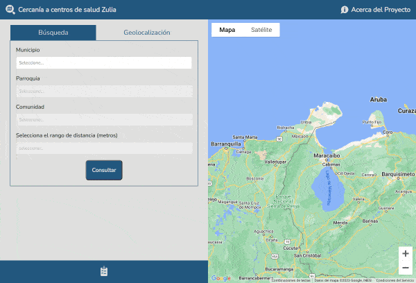

# Encuentra tu centro de salud cercano – Estado Zulia, Venezuela.

Plantilla  de diseño web adaptable  (del ingles _responsive web design_) 
para crear aplicaciones de mapas web con la API de __Google Maps__.

## :eye_speech_bubble: Overview

## Web



## Mobile


## Demo

[Demo](https://cercaniacentrosalud.jfcoordenadas.xyz/)

## :keyboard: Framework
- [Google Maps Platform](https://mapsplatform.google.com/intl/es/)
- [Tom Select JS](https://tom-select.js.org/)

## :rocket: Instalación
Clonar proyecto
```
	git clone https://github.com/juanfernandez2306/cercania_centro_salud.git
```

- Crear una base de datos MySQL +V5.7 con codificación UTF-8
- Nombre de la base de datos _mapa_zulia_
- Cargar script assets/database/01_dpt.sql
- Cargar script assets/database/02_places_community.sql
- Cargar script assets/database/03_places_establishment.sql
- De ser necesario modificar parametros de conexión bd en assets/php/Class/Constants.php

## :bust_in_silhouette: Contactos
- Twitter : https://twitter.com/juancho_2306

## Licencia
Este proyecto está bajo la Licencia [MIT](/LICENSE) - mira el archivo [LICENSE.md](LICENSE.md) para detalles.